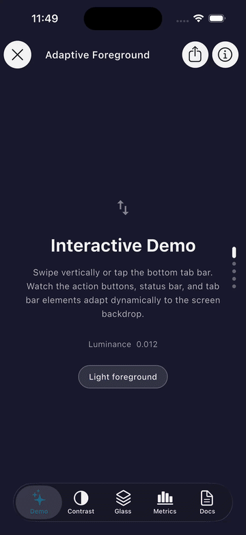

# adaptive_foreground

[](https://pub.dev/packages/adaptive_foreground)
[](LICENSE)
[](https://flutter.dev)

Adaptive foreground color for Flutter. `AppAdaptiveForeground` automatically
selects the highest-contrast foreground color — **black or white** — based on
the luminance of the rendered background, and optionally keeps the system
status-bar icons in sync.

<p align="center">
  
</p>

---

## Features

| Feature | Details |
|---|---|
| **Luminance-based selection** | Computes background brightness and returns the highest-contrast foreground. |
| **Live backdrop sampling** | Periodically captures a low-resolution snapshot of a `RepaintBoundary` to sample the actual rendered pixels — works with gradients, images, and animated backgrounds. |
| **Status-bar sync** | Optionally keeps `SystemUiOverlayStyle` in sync with the resolved color via `AnnotatedRegion`. |
| **Smooth transitions** | Color changes animate with a 300 ms `ColorTween`. |
| **InheritedWidget propagation** | Every descendant can read the resolved foreground color with a single `AppAdaptiveForeground.of(context)` call. |
| **Cross-platform button** | `AppButtonIosAndroid` renders a native iOS `CNButton` on iOS and a Material circular button on Android. |
| **Zero heavy dependencies** | Core widget has no external deps. iOS button uses `cupertino_native`. |

---

## Installation

```yaml
dependencies:
  adaptive_foreground: ^0.0.2
```

```dart
import 'package:adaptive_foreground/adaptive_foreground.dart';
```

---

## Quick start

Wrap your app root inside a `RepaintBoundary` with a `GlobalKey`, then pass
that key to `AppAdaptiveForeground` for live pixel sampling:

```dart
final GlobalKey rootRepaintKey = GlobalKey();

void main() async {
  WidgetsFlutterBinding.ensureInitialized();
  await _configureSystemUI();

  runApp(
    RepaintBoundary(
      key: rootRepaintKey,
      child: AppAdaptiveForeground(
        updateStatusBar: true,
        enableBackdropSampling: true,
        samplingKey: rootRepaintKey,
        child: const MyApp(),
      ),
    ),
  );
}
```

Read the resolved color anywhere below in the tree:

```dart
final foreground = AppAdaptiveForeground.of(context);        // Color
final background = AppAdaptiveForeground.backgroundColorOf(context); // Color
final style      = AppAdaptiveForeground.systemStyleOf(context);     // SystemUiOverlayStyle
```

---

## Strategies

### 1 — `backgroundColorHint` (instant)

Best when you know the background color at build time (e.g. a solid `Scaffold`
background):

```dart
AppAdaptiveForeground(
  backgroundColorHint: Colors.deepPurple,
  child: const MyPage(),
)
```

### 2 — `samplingKey` + `enableBackdropSampling` (live)

Best for dynamic backgrounds (images, gradients, hero animations). Wrap the
outermost widget in a `RepaintBoundary` and pass its key:

```dart
final GlobalKey rootRepaintKey = GlobalKey();

RepaintBoundary(
  key: rootRepaintKey,
  child: AppAdaptiveForeground(
    enableBackdropSampling: true,
    samplingKey: rootRepaintKey,
    updateStatusBar: true,
    child: const MyApp(),
  ),
)
```

---

## API reference

### `AppAdaptiveForeground`

| Parameter | Type | Default | Description |
|---|---|---|---|
| `child` | `Widget` | required | Widget subtree to wrap. |
| `backgroundColorHint` | `Color?` | `null` | Known background color for instant luminance calculation. |
| `samplingKey` | `GlobalKey?` | `null` | Key of a `RepaintBoundary` to sample pixels from. |
| `enableBackdropSampling` | `bool` | `false` | Enables periodic pixel sampling. |
| `samplingInterval` | `Duration` | `150 ms` | Sampling frequency. |
| `darkColor` | `Color` | `Colors.black` | Foreground for bright backgrounds. |
| `lightColor` | `Color` | `Colors.white` | Foreground for dark backgrounds. |
| `threshold` | `double` | `0.5` | Luminance threshold for dark/light switching. |
| `hysteresis` | `double` | `0.08` | Dead zone around `threshold` that prevents oscillation. Switch to bright only when luminance > `threshold + hysteresis`; switch to dark only when luminance < `threshold - hysteresis`. |
| `sampleLocalArea` | `bool` | `true` | Sample only the widget's own area vs. the top strip (status-bar region). |
| `updateStatusBar` | `bool` | `false` | Write the resolved style to `SystemUiOverlayStyle`. |
| `systemOverlayStyle` | `SystemUiOverlayStyle?` | `null` | Manual override for the resolved overlay style. |

#### Static accessors

```dart
// Resolved foreground color (black or white)
Color color = AppAdaptiveForeground.of(context);

// Resolved semi-transparent background tint
Color bg = AppAdaptiveForeground.backgroundColorOf(context);

// Resolved SystemUiOverlayStyle
SystemUiOverlayStyle style = AppAdaptiveForeground.systemStyleOf(context);
```

---

### `AppButtonIosAndroid`

A circular action button that adapts to the current platform.

```dart
AppButtonIosAndroid(
  symbol: 'square.and.arrow.up',   // SF Symbol — iOS only
  icon: Icons.share_outlined,       // Material icon — Android
  color: AppAdaptiveForeground.of(context),
  onPressed: _share,
)
```

| Parameter | Type | Description |
|---|---|---|
| `symbol` | `String?` | SF Symbol name (**required on iOS**). |
| `icon` | `IconData?` | Material icon (used on Android & other platforms). |
| `onPressed` | `VoidCallback?` | Tap callback. Pass `null` to disable. |
| `color` | `Color?` | Tint / foreground color. |
| `isOutline` | `bool` | Renders an outline variant on Android. |
| `buttonSize` | `double?` | Custom size (defaults to `AppDimensions.iconXL - 6`). |

---

## System UI configuration

A recommended `_configureSystemUI` for apps using this package:

```dart
Future<void> _configureSystemUI() async {
  await SystemChrome.setPreferredOrientations([
    DeviceOrientation.portraitUp,
    DeviceOrientation.portraitDown,
  ]);

  final overlays = defaultTargetPlatform == TargetPlatform.android
      ? const <SystemUiOverlay>[SystemUiOverlay.top]
      : SystemUiOverlay.values;

  await SystemChrome.setEnabledSystemUIMode(
    SystemUiMode.manual,
    overlays: overlays,
  );
}
```

---

## Example app

See the fully-worked example in [`example/lib/main.dart`](example/lib/main.dart).

To run it:

```bash
cd example
flutter create --project-name adaptive_foreground_example . # adds platform folders
flutter run
```

---

## License

[MIT](LICENSE) © 2026 Mohammed Jaber

---

## Author

**Mohammed Jaber**

[](https://github.com/mjaber5)
[](https://www.linkedin.com/in/mohammad-jaber-profile/)
[](mailto:mhammdjbr555@gmail.com)
